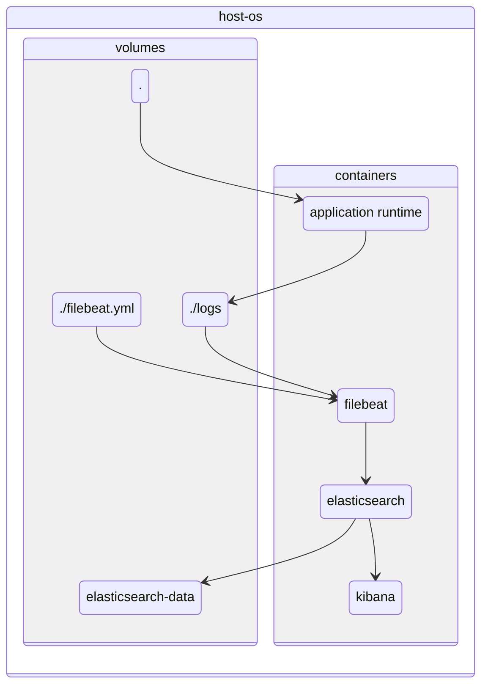
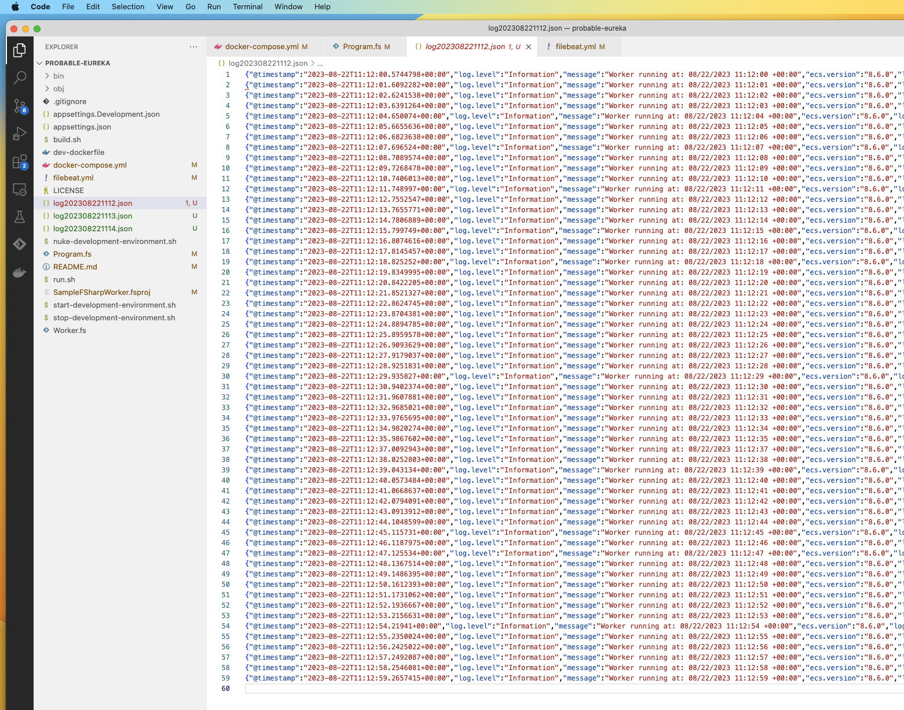
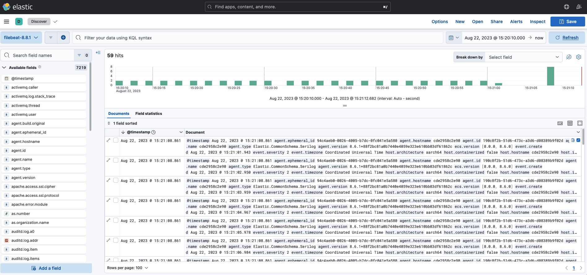

# probable-eureka

f# + filebeat + elasticsearch + kibana + docker-compose

## communication diagram

Logs are propagated as follows:

Rolling log files:

Kibana:

## how to use

* `./start-development-environment.sh`
* `./stop-development-environment.sh`
* `./build.sh`
* `./run.sh`
* `./nuke-development-environment.sh`

### kibana

* http://localhost:5601/app/discover#/?_g=()
* main menu -> analytics -> discover
* create data view
  * index name
  * index pattern
  * timestamp field
  * save data view to kibana

## resources used

* https://www.elastic.co/blog/getting-started-with-the-elastic-stack-and-docker-compose - looks like filebeat goes directly to elasticsearch. It should be logstash instead.
* https://www.elastic.co/guide/en/beats/filebeat/current/running-on-docker.html - Run Filebeat on Docker
* https://www.elastic.co/guide/en/beats/filebeat/current/filebeat-installation-configuration.html
* https://www.elastic.co/guide/en/beats/filebeat/current/configuring-howto-filebeat.html - Configure Filebeat
* https://www.elastic.co/guide/en/ecs-logging/dotnet/master/setup.html - elastic + filebeat + dotnet, specifically this: https://www.elastic.co/guide/en/ecs-logging/dotnet/master/setup.html#setup-step-3
* https://www.elastic.co/guide/en/ecs-logging/dotnet/master/serilog-formatter.html - serilog formatter
